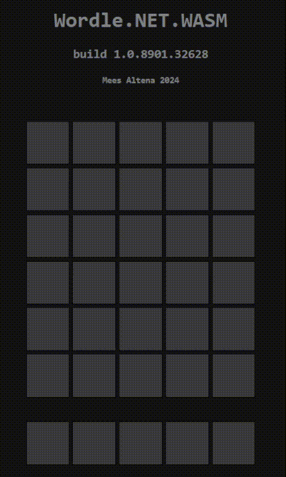

# Worlde.NET.WASM

Wordle clone written in .NET 8. Done as an experiment with Blazor WASM.

Lists of allowed guesses & possible answeres are taken from https://gist.github.com/cfreshman/dec102adb5e60a8299857cbf78f6cf57

A letter is shown in red when it has already been wrongly guessed before.

Please note that this project is not affiliated with Wordle in any way.

